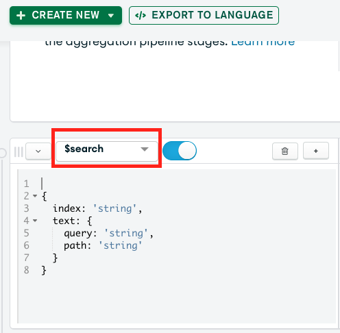

# WORKSHOP: MongoDB for Text and Semantic Search

The goal of this lab is to get you familiar with some of the MongoDB Atlas Search features and the MongoDB Python Driver.

Answers for the exercises can be found in the `answers/` folder.  

## Exercise 0: Prerequisites
### Step 1: Access MongoDB Atlas cluster  

   - Login to the attendee portal https://www.atlas-labs.cloud/ using your **email** as a username.
   - Gain access to your dedicated cluster by clicking on <b>Atlas Cluster</b> in the top left corner.
   - The e-mail will be pre-populated. To login use the following password: "***AtlasW0rkshop!*** "

>Great! By default, Atlas cluters are not reachable from the internet. Therefore, all the clusters have been pre-configured for both Network Security and User Authentication and Authorization. All clusters share the same credentials: <br />
*username:* **adpadmin** <br />
*password:* **adpadminpass**<br />

## Exercise 1 : Load Data in Atlas
#### Explanation and How-to
Within this repo folder, you will find a [`corpus.txt`](https://github.com/yberrada/MongoDBAtlasDeveloperDay/blob/main/corpus.txt) file containing the **History** section of ADP's page on wikipedia https://en.wikipedia.org/wiki/ADP_(company).This is the dataset that will be used throughout the Workshop

#### Exercise
### Step 1 - Clone Github Repo
We're going to start by setting up our project. Start by creating a folder for the workshop content. 
- Execute the commands below in your terminal: 
  ```
  mkdir mongodb-devday
  cd mongodb-devday
  ```
- Now, clone the git repo:
  ```
  git clone https://github.com/yberrada/MongoDBAtlasDeveloperDay.git
  ```

### Step 2 - Load Data into Atlas

- Open the project in your favorite IDE and update your connection string in the`./MongoDBAtlasDeveloperDay/params.py`. To do so:
  - Go to the **Data Services** Tab. 
  - Under the cluster view, Click on **Connect**
   

  - Select **Connect your application**
  - Make sure the python driver is selected and Copy the connection string. 
  - Update the connection string in the `params.py` file.

- Now, install the pre-requisites:
  ```
  pip3 install -r requirements.txt
  ```
- Run the `load.py` to start loading chunks of the the `corpus.txt`:
  ```
  python3 load.py
  ```


The paragraph in the file was split to multiple sentences, each loaded in your MongoDB Atlas Cluster as a document. Go to Atlas, click on Collections and explore the data under the `devday` database and collection name `wikipedia`.
Below is a snippet of what the records look like:


## Exercise 2 : Create an Atlas Search Index and Search

#### Explanation and How-to
[Atlas Search](https://www.mongodb.com/docs/atlas/atlas-search/) is an embedded full-text search capability in MongoDB Atlas that gives you a seamless, scalable experience for building relevance-based app features. Built on Apache Lucene, Atlas Search eliminates the need to run a separate search system alongside your database.

In short, fulltext search queries typically deliver a wider range of records than regular database queries, and those records are returned sorted by `relevancy`. 

Moreover, fulltext search also delivers capabilities such as typo tolerance through fuzzy matching, highlighting of result snippets matching the query, and more. Feel free to explore some of the capabilities on [this documentation page](https://www.mongodb.com/atlas/search).

#### Exercise
We will be creating search indexes on top of the new `wikipedia` collection. 

#### Exercise
Please follow the instructions below to create a new search, optimized search index:
1. In the **Atlas UI**, go to the **Search** page. There is a link called `Search` on the left-hand panel.
2. Select your cluster and hit the `Go to Atlas Search` button. You should see the search index you previously made here. 
3. Hit the `CREATE INDEX` button in the upper-right-hand side. 
4. Keep `Visual Editor` selected and hit the `Next` button.
5. Set the index name to `default` and select the `wikipedia` collection in the `devday` database. Hit `Next`.
6.  Hit `Create Search Index` to create your new `default` index.

It will take a couple of minutes for the index to be built. The Atlas UI shows the state of the index as it changes. 

---
>Note that, for the free-tier M0 cluster, only 3 search indexes can be built. This is not a limitation for any other cluster tier.
---

This default index configuration will capture all indexable fields and make them all available for search. This is called `dynamic indexing`, which is useful for collections within which documents' schemas change. However, this approach typically results in a larger index size. Atlas allows you to select specific fields to be indexed but that's out of scope for today.

Once the index is ready, go back to Atlas. Select the `wikipedia` collection and go to the `Aggregations` tab like before. Hit `Add Stage` and enter `$search` for the first stage. Atlas should provide you with the syntax. Try running the following query in the search stage:  
```
{
  index: 'default',
  text: {
    query: 'Automatic Data Processing',
    path: 'sentence',
    fuzzy:{
      maxEdits: 2,
      prefixLength: 0
    }
  }
}
```
Note that `fuzzy` is enabled which means that our search query is typo tolerant.

To see the `relevancy score`, add a subsequent `$project` stage to the pipeline:
```
score: {
    $meta: "searchScore",
  },
```
Here is a full aggregation pipeline:
```
[
  {
    $search: {
      index: "default",
      text: {
        query: "Automatic Data Processing",
        path: "sentence",
      },
    },
  },
  {
    $project:
      /**
       * specifications: The fields to
       *   include or exclude.
       */
      {
        title: 1,
        text: 1,
        score: {
          $meta: "searchScore",
        }
      },
  },
]
```


Next, play around [Compound search](https://www.mongodb.com/docs/atlas/atlas-search/compound/#definition): (Search queries on multiple fields). Below is an example that you could try.

```
{
  index: "default",
  compound: {
    should: {
      text: {
        path: "sentence",
        query: "ADP",
        fuzzy: {
          maxEdits: 2,
        },
      },
    },
    mustNot: {
      text: {
        path: "sentence",
        query: "revenue",
      },
    },
  },
}
```

## Exercise 3 : Semantic Search

#### Explanation and How-to
You can perform semantic search on data in your Atlas cluster running MongoDB v6.0.11 or later using Atlas Vector Search. You can store vector embeddings for any kind of data along with other data in your collection on the Atlas cluster. Atlas Vector Search supports embeddings that are less than and equal to 2048 dimensions in width.

When you define an Atlas Vector Search index on your collection, you can seamlessly index vector data along with your other data and then perform semantic search against the indexed fields.

Atlas Vector Search uses the [Hierarchical Navigable Small Worlds](https://arxiv.org/abs/1603.09320) algorithm to perform the semantic search. You can use Atlas Vector Search support for approximate nearest neighbord (aNN) queries to search for results similar to a selected product, search for images, etc.

#### Exercise
Let's start by loading the vectorized documents in Atlas under the `wiki_embeddings` collection. To do so, go back to your terminal and run the `load.py` with the `vector` argument to start loading chunks of the the `corpus.txt`:
  ```
  python3 load.py -a vector
  ```

Let's create a search index using the embeddings already available for the `wikipedia` collection's docs. 

1. Back in the **Atlas web UI**, go to the **Search** page. There is a link called `Search` on the left-hand panel.
2. Select your cluster and hit the `Go to Atlas Search` button. You should see the search index you previously made here. 
3. Hit the `CREATE INDEX` button in the upper-right-hand side.
4. This time, select `JSON Editor` and hit `Next`.
5. Name this index `vector` and replace the default definition with this one:
```JSON
{
  "mappings": {
    "dynamic": false,
    "fields": {
      "docVector": {
        "dimensions": 384,
        "similarity": "cosine",
        "type": "knnVector"
      }
    }
  }
}
```
1. Select the `devday` database's `wiki_embeddings` collection to build this index on and hit `Next`.
2. Hit `Create Search Index`.
It should take only a couple of minutes for this index to be created and reach `ACTIVE` status, meaning that it is searchable.

## Exercise 4 : Test Query in Atlas

Once the index is ready, go back to `Collections`, select the `wiki_embeddings` collection and go to the `Aggregations` tab like before. Hit `Add Stage` and enter `$search` for the first stage. Compass should provide you with sample syntax. To run a vector search query,  
We now can test our Search Index through the aggregation pipeline builder. 
- Go back to ‘**Browse Collections**’ and select the '**sample-mflix.movies**' collection.
 

- Click on the '**Aggregation**' tab 
- Select the '**$search**' aggregation pipeline stage in the dropdown menu.
 

- Try running the following query in the search stage:  
```
    {
        "$search": {
            "knnBeta": {
                /**
                * The vector value is the vectorized version of the following string: "When was Automatic Payrolls founded?".
                */
                "vector": [-0.1140311136841774, 0.04337364062666893, -0.06892573833465576, 0.030210305005311966, -0.10324215888977051, 0.02527802251279354, 0.0202903114259243, -0.0073062963783741, -0.06628787517547607, 0.00977123063057661, 0.014603870920836926, 0.052531346678733826, 0.001723986235447228, 0.032441820949316025, -0.11804583668708801, -0.07846555858850479, 0.019784796983003616, -0.09142080694437027, 0.10474223643541336, -0.01661759987473488, -0.03516700863838196, -0.0385245755314827, -0.04499976336956024, -0.023078935220837593, 0.1186455488204956, 0.009249485097825527, -0.03244544193148613, -0.02246006578207016, -0.0013353873509913683, 0.018889348953962326, -0.10112033784389496, -0.08684533834457397, 0.0963592603802681, 0.05393465980887413, 0.03072623535990715, -0.051582835614681244, 0.05300157889723778, 0.10122212022542953, -0.04721859097480774, -0.0057230605743825436, -0.05280035734176636, -0.09435325115919113, 0.014308685436844826, -0.04231730476021767, -0.0682157352566719, 0.06072055175900459, 0.051590446382761, 0.07015663385391235, -0.05717114731669426, 0.08928947150707245, 0.045435432344675064, -0.03905261680483818, 0.11269910633563995, 0.04175883159041405, 0.01718728244304657, 0.048302844166755676, 0.049974121153354645, 0.00553306145593524, -0.04880208149552345, 0.030968738719820976, -0.06316998600959778, -0.02045135758817196, -0.0909106656908989, 0.033318400382995605, 0.09360678493976593, 0.048102106899023056, -0.011684827506542206, -0.07313867658376694, 0.013052280060946941, -0.02239864692091942, -0.06088097020983696, -0.05690339207649231, -0.033970121294260025, 0.028621457517147064, 0.044662538915872574, 0.013178166002035141, -0.009934382513165474, 0.017407387495040894, -0.02004309929907322, -0.09726029634475708, -0.07399231195449829, 0.03589576482772827, 0.051985591650009155, 0.11988113075494766, -0.023931266739964485, -0.024081433191895485, -0.030970286577939987, 0.03900601342320442, 0.13575756549835205, -0.05921594798564911, 0.03849533945322037, 0.029021482914686203, -0.02626021020114422, -0.05079701170325279, -0.008586134761571884, -0.038401905447244644, 0.02343091368675232, 0.0776505246758461, 0.07631481438875198, 0.005020556040108204, 0.058237411081790924, -0.008742650039494038, 0.028878726065158844, 0.021741414442658424, 0.010543150827288628, 0.030535751953721046, -0.01960851065814495, 0.011159843765199184, 0.017362726852297783, -0.03333581984043121, -0.04773659631609917, 0.019984500482678413, 0.05730288475751877, -0.06093277409672737, -0.045925673097372055, 0.004894603975117207, -0.037497397512197495, 0.02750672772526741, 0.043432991951704025, -0.02725108712911606, 0.038977500051259995, 0.008480366319417953, -0.11740712076425552, -0.07828488945960999, -0.03877123072743416, 0.06561283767223358, -0.0006176282186061144, -4.161531385871126e-33, -0.019673414528369904, 0.06800507754087448, 0.03208640590310097, 0.06050342321395874, 0.010170704685151577, -0.07548180967569351, 0.015623515471816063, 0.0296639297157526, 0.05911415070295334, 0.01698625087738037, 0.015057124197483063, 0.03348201513290405, -0.0029551188927143812, -0.008016044273972511, 0.031502749770879745, -0.05850094184279442, -0.02429160103201866, 0.014193257316946983, 0.08347376435995102, 0.010403025895357132, 0.00016003413475118577, -0.04950707405805588, 0.02873918041586876, -0.060928039252758026, 0.04896567389369011, 0.07130377739667892, -0.05465045943856239, 0.03261080011725426, 0.022850017994642258, 0.055662915110588074, 0.08114658296108246, -0.04207337647676468, 0.010175017639994621, 0.027453668415546417, -0.058879733085632324, 0.042183540761470795, 0.000624392181634903, -0.047660671174526215, 0.013209869153797626, -0.0197734497487545, 0.10042088478803635, 0.01820376329123974, 0.0875496119260788, -0.06076003611087799, 0.00010837671288754791, 0.10962190479040146, -0.029213204979896545, 0.09481377899646759, 0.0713549479842186, 0.021656837314367294, 0.05271885171532631, -0.037683144211769104, -6.928921357030049e-05, -0.02176290564239025, 0.014942378737032413, 0.03795695677399635, 0.004184049554169178, -0.030032634735107422, 0.028949197381734848, 0.0029956710059195757, 0.00797599833458662, 0.08432136476039886, -0.008674338459968567, 0.009376253932714462, -0.06601811945438385, -0.01491799671202898, 0.0646241158246994, -0.007781886495649815, 0.036464422941207886, 0.04326440766453743, 0.028563804924488068, 0.04734057933092117, -0.01361131202429533, -0.06811031699180603, -0.021401025354862213, 0.0904960036277771, 0.057148322463035583, -0.005634688772261143, -0.0528206042945385, 0.014569252729415894, -0.023466261103749275, -0.0013156005879864097, 0.0677519366145134, 0.018875665962696075, 0.06071510165929794, 0.026184294372797012, 0.03887661546468735, 0.10123757272958755, -0.010316603817045689, -0.03352484107017517, -0.019312025979161263, -0.02693808451294899, 0.04194829240441322, 0.085558220744133, -0.044565390795469284, 2.903171111800598e-33, -0.0033476664684712887, 0.002892725868150592, -0.011626437306404114, 0.060992851853370667, 0.0028959119226783514, -0.009278891608119011, 0.033608466386795044, -0.0520448163151741, 0.023402849212288857, 0.0191426370292902, 0.023364605382084846, -0.03781650960445404, -0.035299066454172134, -0.010184439830482006, 0.040531888604164124, 0.004881335888057947, -0.03210979700088501, -0.05770169943571091, -0.0030108517967164516, 0.002307669259607792, 0.03965296596288681, -0.011349830776453018, -0.048003774136304855, 0.057669561356306076, 0.09645064175128937, -0.00015939096920192242, -0.020125972107052803, 0.012629111297428608, -0.100211501121521, 0.10704018920660019, -0.05473543703556061, -0.0068112327717244625, -0.030439868569374084, 0.0700426995754242, -0.03028147667646408, -0.05685339868068695, -0.09187252074480057, 0.061062686145305634, 0.036794696003198624, -0.02195349708199501, 0.04018457233905792, -0.04146328568458557, -0.0366317443549633, 0.10539271682500839, -0.003573037451133132, -0.03908257558941841, -0.06675799936056137, 0.004746719263494015, 0.014644107781350613, -0.03210451826453209, -0.05406465381383896, -0.042562562972307205, 0.050491493195295334, -0.00960751622915268, -0.07968898117542267, 0.10229013860225677, 0.01375345978885889, 0.005551970563828945, -0.0021326534915715456, 0.03621584549546242, 0.02458251640200615, -0.029737291857600212, 0.018312424421310425, 0.051465779542922974, -0.03733893111348152, -0.029046285897493362, 0.023201847448945045, 0.007349195424467325, 0.0032995243091136217, -0.03174467384815216, 0.05919768288731575, 0.0035525767598301172, 0.013309331610798836, 0.009962699376046658, -0.05565476790070534, 0.03581438586115837, 0.08497116714715958, -0.053351808339357376, -0.09932706505060196, -0.04226544499397278, -0.08705560117959976, -0.008235959336161613, 0.012849547900259495, 0.01410931721329689, -0.06082933023571968, 0.02695496380329132, -0.02929016947746277, -0.012376277707517147, -0.022610507905483246, 0.020424865186214447, 0.0021430100314319134, -0.05012032389640808, -0.019889606162905693, 0.015967030078172684, -0.047397855669260025, -1.4506493783983387e-08, 0.0016951049910858274, 0.03094794601202011, 0.030510596930980682, 0.0002949716290459037, 0.043126948177814484, -0.10494138300418854, 0.05136481299996376, 0.024138614535331726, 0.023121116682887077, -0.006184462923556566, -0.02055288292467594, -0.008909551426768303, 0.01004001498222351, 0.010309474542737007, 0.03378763794898987, -0.05474638566374779, -0.023482613265514374, 0.09516367316246033, -0.14292867481708527, -0.032086990773677826, 0.03620201349258423, 0.04140852764248848, -0.02700047567486763, -0.09216393530368805, -0.0159924179315567, -0.019668757915496826, 0.02870897203683853, 0.03490287438035011, 0.023601925000548363, 0.039879098534584045, -0.06045990437269211, 0.10220221430063248, -0.042210958898067474, -0.0787273496389389, -0.0035443739034235477, 0.0556890144944191, 0.0178891122341156, -0.06241793930530548, -0.03417268395423889, -0.1954275518655777, 0.005650341045111418, 0.07556935399770737, -0.029854321852326393, -0.011923735029995441, -0.022561922669410706, -0.007360907271504402, -0.10051650553941727, 0.04825272411108017, 0.0082402303814888, -0.07207966595888138, 0.018363209441304207, 0.03386106342077255, 0.074559286236763, -0.006421489641070366, -0.009572077542543411, -0.08867651224136353, 0.012539670802652836, -0.12523384392261505, -0.03867035359144211, -0.0475669763982296, -0.00834816787391901, -0.007267664186656475, 0.0970538929104805, -0.016540827229619026],
                "path": "docVector",
                "k": 150
            }
        }
    },
    {
        "$limit": 1
    }
```
> The search stage should match a movie titled: *The Storyteller*. Notice that our query string is *Storteler*.


## Exercise 5 : Test Query in Code

Now is the time to test your vector search index through code: 
- From the Atlas Aggregation builder, export the pipeline to Python syntax by clicking on **EXPORT TO LANGUAGE**.
- Make sure to copy the pipeline code.
- Go back to the python project and locate `search.py` file. 
- The python code is only missing the aggregation pipeline. Paste it and test your code: 
```python3 search.py -q "When was automated processing founded"```
- Other Questions to test your code with can be: 
  

---
>Congratulations on completing the lab!
---